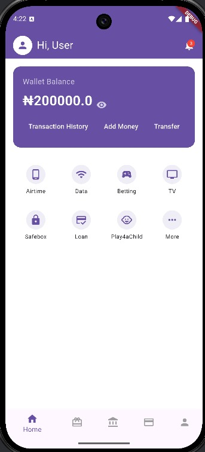
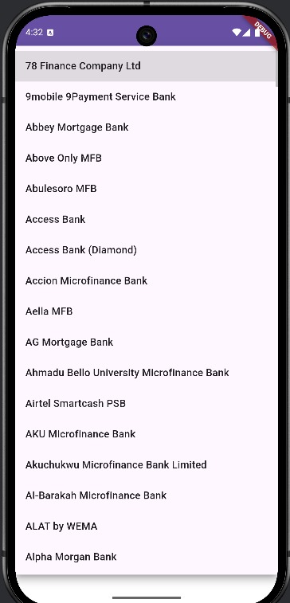
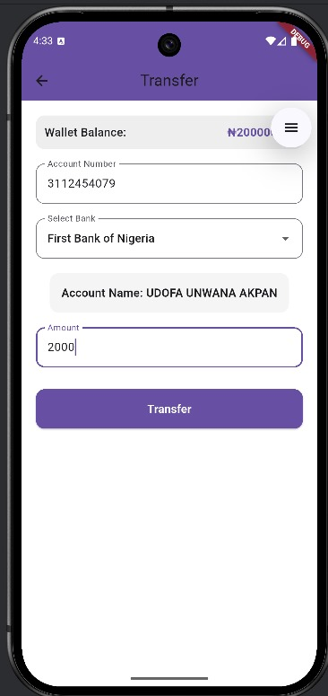
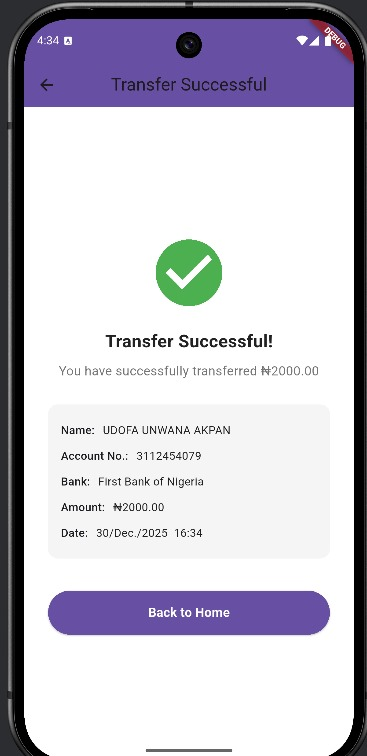
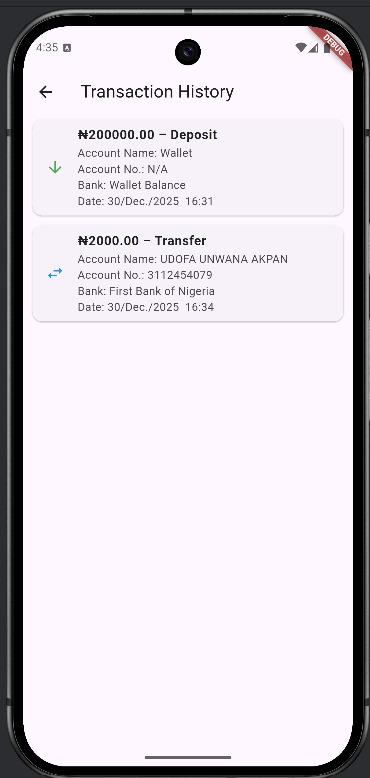

# ✅ Fintech App

*Fintech App* is a Flutter-based mobile application designed to help users manage their wallet balance, perform deposits and transfers, and view transaction history. It features a clean UI, Bloc state management, *Paystack integration* for real payments, and light/dark theme toggling. Transactions are logged with details and balance tracking for a realistic banking experience.

---

## 📱 Features

### Wallet Management
- 💰 *View Balance*: Check wallet balance with toggle visibility.  
- ➕ *Deposit Money: Add funds to your wallet via **Paystack integration*.  
- 🔄 *Transfer Money*: Send funds to another account.  

### Transactions
- 📝 *Confirm Transfer*: Double-check details before sending.  
- ✅ *Success Screen*: Shows transaction details and timestamp.  
- 📜 *Transaction History*: View all deposits and transfers with balance after each transaction.  
- 🔍 *Filter Transactions*: Switch between All, Deposits, and Transfers.  

### UI & UX
- 🎨 *Modern Theme*: Supports light and dark mode via ThemeCubit.  
- 📊 *Balance Tracking*: Shows updated balance after each transaction.  
- 📱 *Responsive UI*: Works smoothly on Android and iOS.  

---

## 🔧 Tech Stack
- *Flutter*: Cross-platform mobile framework  
- *Dart*: Programming language for Flutter  
- *Bloc (flutter_bloc)*: State management  
- *Paystack*: Payment gateway integration for deposits  
- *Material Design*: UI components and theming  

---

## 🧑‍💻 Usage

1. *Dashboard*: View wallet balance and quick actions.  
2. *Deposit*: Add money to your wallet using Paystack.  
3. *Transfer*: Input recipient details and amount.  
4. *Confirm Transfer*: Review details before sending.  
5. *Success Screen*: See confirmation with timestamp.  
6. *History*: Track all transactions with balance after each.  
7. *Settings*: Toggle between light/dark themes.  

---

## 📁 Project Structure

```
lib/
├── cubits/
│   ├── wallet_cubit.dart          # Wallet balance state
│   ├── transaction_cubit.dart     # Transaction logging
│   └── theme_cubit.dart           # Theme toggle (light/dark)
├── presentation/screens/
│   ├── dashboard_screen.dart      # Main dashboard
│   ├── deposit_screen.dart        # Deposit funds via Paystack
│   ├── transfer_screen.dart       # Enter transfer details
│   ├── confirm_transfer_screen.dart # Confirm transfer
│   ├── success_screen.dart        # Transfer success
│   ├── history_screen.dart        # Transaction history
│   └── settings_screen.dart       # Theme & settings
└── main.dart                                            # Entry point
```

⚠ *Note*: Some configuration files (e.g., Paystack keys, environment variables) are excluded from this repository for security reasons. They can be provided upon request for testing or collaboration.

---

## 🖼 Screens Overview

- *Dashboard Screen*: Wallet balance, quick actions, services grid, bottom navigation.  
- *Deposit Screen*: Enter deposit amount and pay via Paystack.  
- *Transfer Screen*: Input recipient details and amount.  
- *Confirm Transfer Screen*: Review details before sending.  
- *Success Screen*: Confirmation with transaction details and timestamp.  
- *History Screen*: List of transactions with filters and balance after each.  
- *Settings Screen*: Toggle light/dark theme.


  ## 🖼 Screens Overview

### Dashboard


### Banks


### Transfer


### Confirm Transfer


### Success


### History



---

📄 *License*  
This project is licensed under the MIT License. See the LICENSE file for details.

---

## 📚 Helpful Resources
- [Flutter Documentation](https://flutter.dev/docs)  
- [flutter_bloc Package](https://pub.dev/packages/flutter_bloc)  
- [Paystack Docs](https://paystack.com/docs/)  
- [Material Design](https://material.io/develop/flutter)  

---

📬 *Contact*  
- Email: *unwanaudofa49@gmail.com*  
- GitHub: *Finest321*  
- WhatsApp: [Chat with me](https://wa.me/2349052337774)

💼 Open to job opportunities and collaborations — let’s connect!
